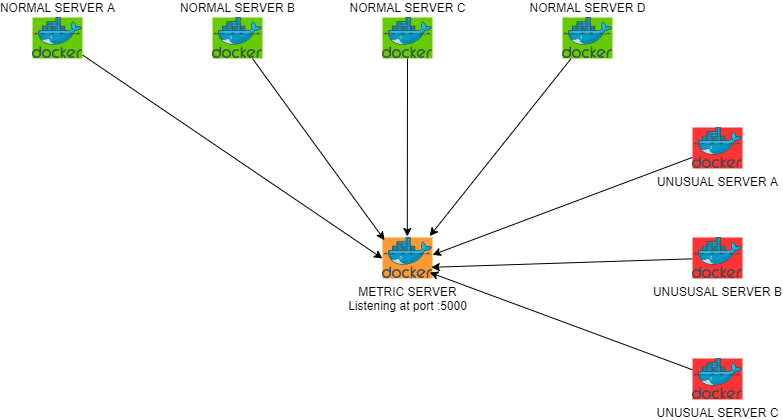

# ACME Metric Hub project

## Prerequisites

### Installing Make
The commands below describes the command needed to install make
to the Operating System of your choice

#### Ubuntu
    sudo apt-get install make -y

#### Fedora / Cent OS / RHEL
    sudo yum install make -y

### Installing the Metric Hub project dependencies

#### Verifying make install
After installing `make`, type `make --version` in the terminal
to verify that it is installed properly.  

You should received an output similar to below:

    ubuntu@vanillaubuntu:~/acme-metric-hub$ make --version
    GNU Make 4.2.1
    Built for x86_64-pc-linux-gnu
    Copyright (C) 1988-2016 Free Software Foundation, Inc.
    License GPLv3+: GNU GPL version 3 or later <http://gnu.org/licenses/gpl.html>
    This is free software: you are free to change and redistribute it.
    There is NO WARRANTY, to the extent permitted by law.

#### Installing the dependencies
Execute the command below to install the metric hub app dependencies according to your workstation's Operating System

##### Ubuntu
    make install-dependencies-debian

##### Fedora / Cent OS / RHEL
    make install-dependencies-fedora

## Running the metric server and the client server

### Running the metric server
To run the metric server, execute command below

    make run-metric-server

You should be able to see output similar to below:

    ubuntu@vanillaubuntu:~/acme-metric-hub$ make run-metric-server 
    bash start_metric_server.sh
    * Serving Flask app "metric_server"
    * Environment: production
    WARNING: This is a development server. Do not use it in a production deployment.
    Use a production WSGI server instead.
    * Debug mode: off
    2021-11-07 05:25:27,346 - werkzeug - INFO -  * Running on http://0.0.0.0:5000/ (Press CTRL+C to quit)

### Verifying 500 reponse

Open another terminal to verify the metric server

When requesting statistics information from the metric server,
using `make get-statistics`. It will return a 500 response
since no report yet has been sent to the metric server.

    ubuntu@vanillaubuntu:~/acme-metric-hub$ make get-statistics 
    curl http://localhost:5000/process_statistics
    <!DOCTYPE HTML PUBLIC "-//W3C//DTD HTML 3.2 Final//EN">
    <title>500 Internal Server Error</title>
    <h1>Internal Server Error</h1>
    
Not enough reports received

### Verifying outlier servers is empty
Since metric server has not yet received reports from its
client servers, Executing `make get-outliers` should return an
empty response

    ubuntu@vanillaubuntu:~/acme-metric-hub$ make get-outliers 
    curl http://localhost:5000/process_outliers
    []

### Running a normal server, sending data to metric server
The normal server will send a report to the metric server
with process lasting from 27 - 30 minutes.  
Open another terminal and execute `make run-normal-server`  
You should see an output similar to below:

    ubuntu@vanillaubuntu:~/acme-metric-hub$ make run-normal-server 
    bash start_normal_acme_server.sh
    2021-11-07 05:44:02,026 - root - INFO - Posting normal batch process: Server name=t-205676662 Start date=2021-11-07T05:44:02Z End date=2021-11-07T06:11:38Z url=http://localhost:5000
    2021-11-07 05:44:04,038 - root - INFO - Posting normal batch process: Server name=t-205676662 Start date=2021-11-07T05:44:04Z End date=2021-11-07T06:11:48Z url=http://localhost:5000

### Checking the statistics and standard deviation
Now, that reports has been sent to the metric server. Execute
`make get-statistics` to get the mean and standard deviation
of all the reports sent to metric server.  

Open another terminal and execute the commands below:

    ubuntu@vanillaubuntu:~/acme-metric-hub$ make get-statistics 
    curl http://localhost:5000/process_statistics
    {"mean":1709,"stddev":53}

### Simulating an outlier server
To test if the metric server can detect an outlier server.
Eexcute `make run-unusual-server` to send outlier report
to metric server. 

    ubuntu@vanillaubuntu:~/acme-metric-hub$ make run-unusual-server 
    bash start_unusual_acme_server.sh
    2021-11-07 06:02:36,179 - root - INFO - Posting unusual batch process: Server name=t-002584168 Start date=2021-11-07T06:02:36Z End date=2021-11-07T06:30:34Z url=http://localhost:5000
    2021-11-07 06:02:46,206 - root - INFO - Posting unusual batch process: Server name=t-002584168 Start date=2021-11-07T06:02:46Z End date=2021-11-07T06:26:54Z url=http://localhost:5000

> Notice that compared to the normal server, the unusual server
> sends data at a slower rate (every 10 seconds).  
> This is intentional so that the metric server will detect it as
> outlier

### Getting the outlier server
Now that there is a normal server and an unusual server sending
outlier data to the metric server.  
An outlier server should appear when executing `make get-outliers`  

Open another terminal, execute the command below:

    ubuntu@vanillaubuntu:~/acme-metric-hub$ make get-outliers
    curl http://localhost:5000/process_outliers
    ["t-002584168"]

## Using Docker to simulate multiple normal and unusual servers

### Closing previously executed servers

#### Stopping Metric Server
Stop the metric server by executing `Ctrl + C` on the previous
terminal

    2021-11-07 06:11:41,385 - werkzeug - INFO - 127.0.0.1 - - [07/Nov/2021 06:11:41] "POST /process_report HTTP/1.1" 200 -
    2021-11-07 06:11:43,395 - metric_server - INFO - Received: Server name=t-205676662 Start time=2021-11-07T06:11:43Z End time=2021-11-07T06:39:27Z
    2021-11-07 06:11:43,397 - werkzeug - INFO - 127.0.0.1 - - [07/Nov/2021 06:11:43] "POST /process_report HTTP/1.1" 200 -
    ^C

#### Stopping Normal Server
Stop the normal server by executing `Ctrl + C` on the previous
terminal

    2021-11-07 06:12:55,625 - root - INFO - Posting normal batch process to http://localhost:5000 failed, reason: <class 'requests.exceptions.ConnectionError'>
    ^CTraceback (most recent call last):
    File "acme_server.py", line 20, in <module>
    time.sleep(args.sleep)
    KeyboardInterrupt
    make: *** [Makefile:39: run-normal-server] Interrupt

#### Stopping Unusual Server
Stop the normal server by executing `Ctrl + C` on the previous
terminal

    2021-11-07 06:14:17,300 - root - INFO - Posting unusual batch process to http://localhost:5000 failed, reason: <class 'requests.exceptions.ConnectionError'>
    ^CTraceback (most recent call last):
    File "acme_server.py", line 20, in <module>
    time.sleep(args.sleep)
    KeyboardInterrupt
    make: *** [Makefile:42: run-unusual-server] Interrupt

### Running many normal servers and unusual servers as containers

To simulate an almost real life situation of the metric server and multiple
client servers. We will use the docker containers to achieve this.

Execute `make docker-run-many` to run the containers

    ubuntu@vanillaubuntu:~/acme-metric-hub$ make docker-run-many 
    sudo docker-compose -f docker-compose.many.yml -p manyacme down
    [sudo] password for ubuntu: 
    Removing network manyacme_default
    ...
    Creating manyacme_unusualacmeserver_b_1 ... 
    Creating manyacme_unusualacmeserver_c_1 ... done
    Creating manyacme_unusualacmeserver_a_1 ... done
    Creating manyacme_metricserver_1        ... done
    Creating manyacme_normalacmeserver_a_1  ... done
    Creating manyacme_normalacmeserver_c_1  ... done
    Creating manyacme_normalacmeserver_b_1  ... done
    Creating manyacme_normalacmeserver_d_1  ... done

#### Checking the outlier servers from the containers
After running the containers, executing `make get-outliers`
should return two or three outlier servers

    ubuntu@vanillaubuntu:~/acme-metric-hub$ make get-outliers 
    curl http://localhost:5000/process_outliers
    ["t-882118835", "t-633081077", "t-434855345"]

Execute `make get-statistics` to get the standard deviation
and mean of the reports from the containers
    
    ubuntu@vanillaubuntu:~/acme-metric-hub$ make get-statistics 
    curl http://localhost:5000/process_statistics
    {"mean":1703,"stddev":136}

The architecture:

### Stopping the containers
Execute `make docker-stop` to free up memory consumed by
the containers

    ubuntu@vanillaubuntu:~/acme-metric-hub$ make docker-stop 
    sudo docker-compose -f docker-compose.many.yml -p manyacme down
    Stopping manyacme_unusualacmeserver_c_1 ... done
    Stopping manyacme_normalacmeserver_c_1  ... done
    Stopping manyacme_normalacmeserver_a_1  ... done
    ...
    Removing manyacme_normalacmeserver_b_1  ... done
    Removing manyacme_unusualacmeserver_a_1 ... done
    Removing network manyacme_default
    sudo docker-compose -f docker-compose.few.yml -p fewacme down
    Removing network fewacme_default
    WARNING: Network fewacme_default not found.

